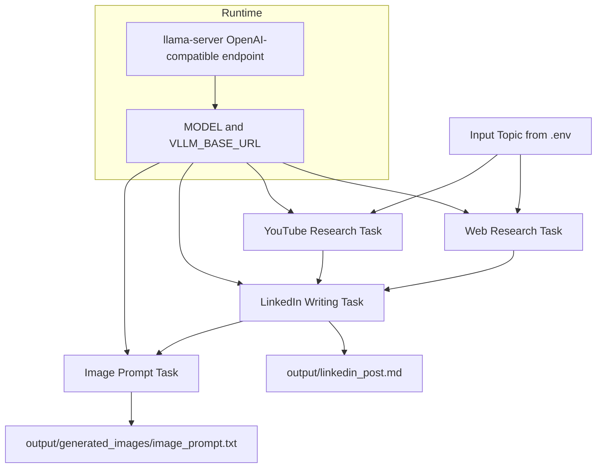

# AI Agent Web Research to LinkedIn Post

A practical CrewAI project that runs a 4-agent workflow to research a topic, generate a polished LinkedIn post, and create an image prompt for downstream image tools.

The pipeline is designed for local LLM execution, optional tool usage, and clean markdown/text outputs.

## What this project does

Given a topic, the workflow:

1. Runs web research with a dedicated internet researcher agent.
2. Runs YouTube intelligence research with a dedicated video analyst agent.
3. Synthesizes both research outputs into a publication-ready LinkedIn post.
4. Generates a production-ready image prompt from the LinkedIn post using the same local text model.
5. Saves the final post and image prompt outputs locally.

## Architecture

- Agent 1: Senior Internet Research Strategist
- Agent 2: Senior YouTube Intelligence Analyst
- Agent 3: Senior LinkedIn Thought-Leadership Writer
- Agent 4: Senior Visual Prompt Strategist
- Process: Sequential CrewAI process
- Collaboration: Delegation disabled for deterministic local-model behavior
- Writer guidance: Knowledge source loaded from `skills/linkedin_post_writing_guide.md`
- Explicit LLM assignment on every agent



## Key features

- Local model support through llama.cpp OpenAI-compatible server
- Optional external tools toggle for small-model compatibility
- Optional knowledge-source toggle for zero-OpenAI startup
- Verbose agent execution logs for debugging and transparency
- Topic configurable via environment variable
- Output persisted as markdown for easy publishing
- Image prompt generation without image API dependency

## Requirements

- Python >= 3.10 and < 3.14
- `uv` package manager
- CrewAI and crewai-tools dependencies
- Local GGUF model + llama.cpp server (required for local run mode)

## Prerequisites

1. Install Python 3.10-3.13.
2. Install `uv`.
3. Install `llama.cpp` server runtime.
4. Ensure your GGUF model file exists at `models/qwen2.5-0.5b-instruct-q4_k_m.gguf`.

Windows example for llama.cpp installation:

```powershell
winget install --id ggml.llamacpp -e --accept-package-agreements --accept-source-agreements
```

## Installation

1. Clone the repository and open it in your terminal.
2. Install project dependencies:

```bash
uv sync
```

3. Create/update `.env` with required values.

## Configuration

Configure environment variables in `.env`.

Example local setup:

```env
MODEL=hosted_vllm/qwen2.5-0.5b-instruct-q4_k_m
VLLM_BASE_URL=http://127.0.0.1:8000/v1
USE_TOOLS=false
USE_KNOWLEDGE=false
TOPIC=AI Agents for Sales Prospecting
```

Example cloud-assisted setup:

```env
USE_TOOLS=true
SERPER_API_KEY=your_serper_key
USE_KNOWLEDGE=true
```

## Run

1. Start llama-server (keep this terminal open):

```powershell
llama-server -m models/qwen2.5-0.5b-instruct-q4_k_m.gguf --host 127.0.0.1 --port 8000 --ctx-size 8192
```

2. Verify the model endpoint (optional but recommended):

```powershell
Invoke-WebRequest -Uri "http://127.0.0.1:8000/v1/models" -UseBasicParsing
```

3. Run the Crew workflow in a second terminal:

```bash
python src/ai_agent_web_research_linkedin/main.py
```

## Troubleshooting

- If you see connection errors, confirm `VLLM_BASE_URL` points to `http://127.0.0.1:8000/v1` and llama-server is running.
- If you see context-size errors, restart llama-server with a higher `--ctx-size` (for example `8192`).
- If quality degrades on small models, keep `USE_TOOLS=false` and `USE_KNOWLEDGE=false` for tighter outputs.

## Output

- Final LinkedIn post file: `output/linkedin_post.md`
- Image prompt text file: `output/generated_images/image_prompt.txt`

## Repository highlights

- `src/ai_agent_web_research_linkedin/main.py`: Crew, agents, and tasks
- `src/ai_agent_web_research_linkedin/config/runtime.py`: Runtime config and knowledge loading
- `src/ai_agent_web_research_linkedin/skills/linkedin_post_writing_guide.md`: Writer quality guide used as knowledge source
- `output/`: Generated markdown results
- `models/`: Local GGUF model files

## Notes

- `knowledge_sources` is the correct CrewAI parameter for agent knowledge injection.
- This project is optimized for practical execution on local/free setups when cloud quotas fail.
